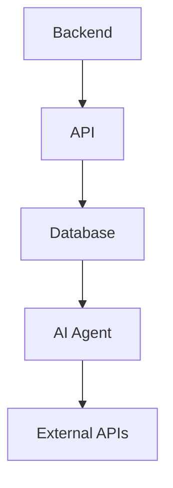

#### Backend - Cập nhật ngày: 28/04/2026

# Tổng quan backend
Đây là backend của trang web học tiếng Trung dành cho người Việt Nam.
### Công nghệ: 
* Python
* FastAPI
* SQLAlchemy
* Alembic
* PyJWT
* Bcrypt
* CORS
* Pydantic
* Uvicorn
## Sơ đồ backend

---

* **Mục tiêu chính:** Xây dựng hệ thống API, quản lý Database và kết nối với AI Agent, External APIs phục vụ trang web học tiếng Trung.
* **Công việc đã thực hiện:** 
  * Khởi tạo tài liệu tổng quan và tech stack.
  * Đã tạo dự án Backend tại thư mục `L:\ChineseLearning\src\backend`.
  * Thiết lập Python Virtual Environment (venv) và cài đặt đầy đủ thư viện.
  * Khởi tạo môi trường Alembic cho Database Migrations.
  * Cấu hình kết nối CSDL SQLite trong `database.py`.
  * Thiết kế schema `models.py` (User, Vocabulary).
  * Viết API endpoint `/api/vocabularies` tại `main.py` và setup tự động tạo bảng.
* **Vấn đề & Giải pháp:** Chưa có vấn đề nào được ghi nhận.
* **Kế hoạch tiếp theo:** Xây dựng tính năng Authentication (JWT), thiết kế Pydantic Schemas và kết nối với AI Agent như kiến trúc đề ra.
