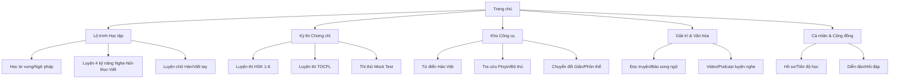

#### Frontend - Cập nhật ngày: 28/04/2026

# Tổng quan trang web
Đây là trang web học tiếng Trung dành cho người Việt Nam.

## Mục tiêu:
Cung cấp kiến thức tiếng Trung cho người Việt Nam.
### Tính năng:
* Học tiếng Trung
* Luyện thi HSK, TOCFL
* Từ điển Hán Việt, Tra cứu pinyin, Chuyển đổi Giản/Phồn thể
* Đọc truyện Hán Việt, Báo song ngữ
* Luyện ngữ pháp, luyện 4 kỹ năng (Nghe, Nói, Đọc, Viết)
* Luyện từ vựng, Luyện chữ Hán/Viết tay, Luyện giao tiếp
* Thi thử Mock Test, Video/Podcast luyện nghe
* Hồ sơ/Tiến độ học, Diễn đàn/Hỏi đáp

#### Giao diện:
* Giao diện thân thiện, dễ sử dụng, đẹp mắt, hiện đại, responsive.
* Có tất cả chế độ background cho người dùng lựa chọn.

##### Công nghệ: 
* HTML, CSS, JavaScript
* React, Redux, Router, Axios
* Formik, Yup, Tailwind CSS

###### Sơ đồ trang web

---

* **Mục tiêu chính:** Hoàn thiện giao diện, UI/UX, và xây dựng toàn bộ tính năng frontend tương tác với người dùng.
* **Công việc đã thực hiện:** 
  * Xác định tính năng, kiến trúc sitemap, và tech stack.
  * Đã khởi tạo dự án Frontend tại `L:\ChineseLearning\src\frontend` với Vite (React) và TailwindCSS v4.
  * Đã cài đặt các thư viện lõi: `react-router-dom`, `axios`, `formik`, `yup`, `react-redux`, `@reduxjs/toolkit`.
  * Xây dựng layout chính (`MainLayout.jsx`) với Sidebar, Header.
  * Tạo trang chủ (`Home.jsx`) dạng Dashboard hiển thị tiến độ học.
  * Tạo trang từ vựng (`Vocabulary.jsx`) tích hợp Axios gọi API Backend.
  * Cấu hình React Router DOM trong `main.jsx` và `App.jsx`.
* **Vấn đề & Giải pháp:** 
  * **Vấn đề:** Cài đặt Tailwind CSS v4 trên Vite có thay đổi cấu trúc so với v3.
  * **Giải pháp:** Sử dụng `@tailwindcss/vite` plugin tích hợp trực tiếp vào `vite.config.js`.
* **Kế hoạch tiếp theo:** Triển khai Redux Toolkit để quản lý State (thông tin user, token), phát triển các Component nhỏ hơn (Card, Table) dùng chung.
